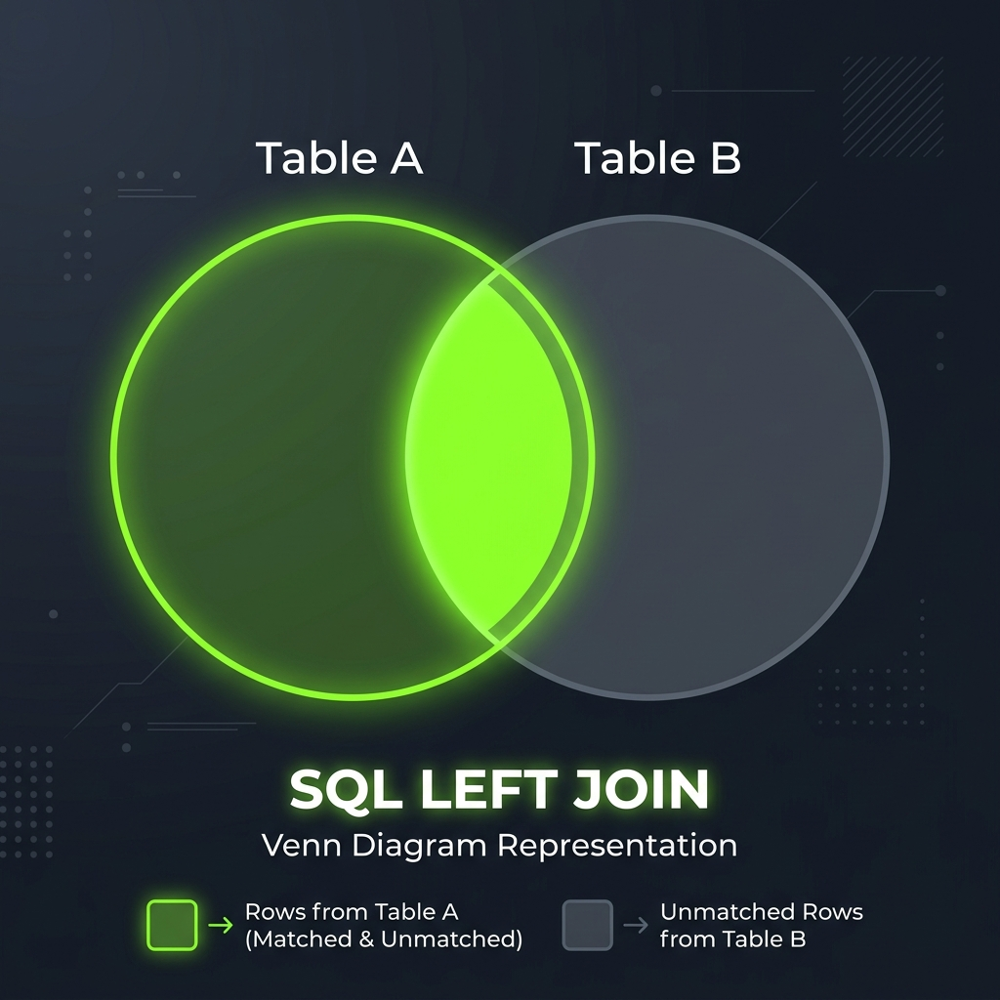
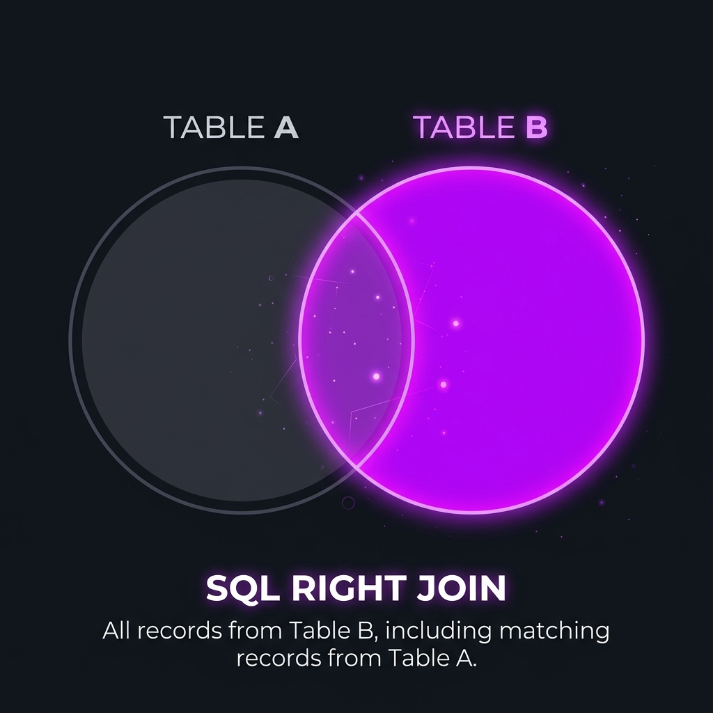

# Day 04: Chapter 3 — Outer Joins: Left & Right Join

While an `INNER JOIN` only returns matching rows, **Outer Joins** allow us to retain rows from one table even when there is no matching record in the other table. Unmatched rows are padded with `NULL` values.

---

## 1. LEFT JOIN (LEFT OUTER JOIN)

A **LEFT JOIN** returns **all records from the left table**, and the matching records from the right table. If no match is found, MySQL returns `NULL` for all columns of the right table.

### Venn Diagram


### Real-World Example
Consider a database of customers and their orders.

#### `Customers` Table (Left)
| customer_id | name | city |
| :--- | :--- | :--- |
| 1 | Alice | Delhi |
| 2 | Bob | Mumbai |
| 3 | Charlie | Delhi |

#### `Orders` Table (Right)
| order_id | customer_id | product | total |
| :--- | :--- | :--- | :--- |
| 1001 | 1 | Laptop | $500 |
| 1002 | 2 | Mobile | $150 |

*(Note: Charlie has placed no orders).*

### The Query
```sql
SELECT c.name, o.order_id, o.product
FROM Customers c
LEFT JOIN Orders o ON c.customer_id = o.customer_id;
```

### Result Set
| name | order_id | product |
| :--- | :--- | :--- |
| Alice | 1001 | Laptop |
| Bob | 1002 | Mobile |
| Charlie | NULL | NULL |

*   Charlie is included because he is in the left table (`Customers`). His order details are returned as `NULL`.

---

## 2. RIGHT JOIN (RIGHT OUTER JOIN)

A **RIGHT JOIN** returns **all records from the right table**, and matching records from the left table. If no match is found, MySQL returns `NULL` for the columns of the left table.

### Venn Diagram


### Swapped Query Example
We can swap the table positions and use a `RIGHT JOIN` to achieve the exact same output:
```sql
SELECT c.name, o.order_id, o.product
FROM Orders o
RIGHT JOIN Customers c ON o.customer_id = c.customer_id;
```
*(Since `Customers` is on the right of the `JOIN` keyword, all customers are preserved).*

> [!TIP]
> In real-world development, **`LEFT JOIN` is preferred** because it matches natural left-to-right reading order. You can rewrite any `RIGHT JOIN` as a `LEFT JOIN` simply by swapping the tables.

---

## 3. Finding Missing or Orphaned Records (IS NULL Pattern)

A primary use case of `LEFT JOIN` is identifying records in one table that have no matching relationship in another.

### Query: Find customers who have never placed an order
```sql
SELECT c.name, c.city
FROM Customers c
LEFT JOIN Orders o ON c.customer_id = o.customer_id
WHERE o.order_id IS NULL; -- Filter for unmatched rows
```

### Result Set
| name | city |
| :--- | :--- |
| Charlie | Delhi |

---

## 4. The "WHERE Clause Filter" Pitfall

A common mistake is applying a filter on the right-side table inside the `WHERE` clause instead of the `ON` clause. This accidentally converts your `LEFT JOIN` into an `INNER JOIN`.

### ❌ The Bug
Imagine you want to list all customers and show their laptop orders (if any).
```sql
SELECT c.name, o.product
FROM Customers c
LEFT JOIN Orders o ON c.customer_id = o.customer_id
WHERE o.product = 'Laptop';
```
*   **Why it fails**: Since Charlie has no orders, his `o.product` is `NULL`. Evaluating `NULL = 'Laptop'` returns `FALSE`, removing Charlie entirely. The query behaves like an `INNER JOIN`.

### ✔ The Solution
Move the right-table filter into the `ON` clause:
```sql
SELECT c.name, o.product
FROM Customers c
LEFT JOIN Orders o ON c.customer_id = o.customer_id AND o.product = 'Laptop';
```
*   **Why it works**: The filter is applied during the matching phase. Charlie will still be returned, but with a `NULL` product name.
