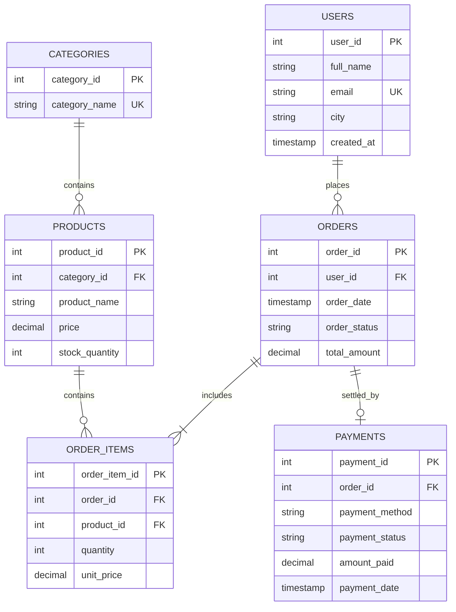

# Day 14: Chapter 1 — Capstone Project Overview: ShopSphere E-Commerce

Welcome to the **Capstone Project**! In this final hands-on project, you will apply all the concepts learned throughout this 14-day masterclass—including Database Design, 3NF Normalization, Advanced Joins, Aggregations, Subqueries, CTEs, Views, B-Tree Indexes, Stored Procedures, Triggers, and TCL Transactions—to build a production-ready database system for an e-commerce platform called **ShopSphere**.

---

## 🏬 Business Domain & Architecture

**ShopSphere** is a multi-category e-commerce platform that connects customers with product vendors. The system requires a highly scalable, normalized, and transaction-safe relational database.

```
                         [ ShopSphere E-Commerce System ]
                                        │
      ┌─────────────────┬───────────────┼───────────────┬─────────────────┐
      ▼                 ▼               ▼               ▼                 ▼
 ┌──────────┐     ┌──────────┐    ┌──────────┐    ┌──────────┐      ┌──────────┐
 │ Users &  │     │ Product  │    │ Orders & │    │ Customer │      │ Audit    │
 │ Customers│     │ Catalog  │    │ Items    │    │ Payments │      │ Logs     │
 └──────────┘     └──────────┘    └──────────┘    └──────────┘      └──────────┘
```

### Core Business Modules:
1. **User & Customer Management**: Stores customer profiles, contact info, and registration details.
2. **Product Catalog & Inventory**: Manages product categories, pricing, stock levels, and calculated fields.
3. **Order Processing & Items**: Tracks customer orders and individual line items with quantity and price snapshots.
4. **Payments & Billing**: Logs transaction payment methods, statuses, and completion timestamps.
5. **Audit Logging & Automation**: Automatically records critical events, logs order actions via triggers, and deducts inventory stock in real time.

---

## 📐 Entity-Relationship (ER) Diagram

Below is the normalized relational data model for ShopSphere:



---

## 🎯 Key Technical Requirements

To achieve a 100% complete enterprise database, the implementation must satisfy these constraints:

### 1. Database Normalization (3NF)
All entities must adhere to 3rd Normal Form (no multi-valued cells, no partial key dependencies, no non-key transitive dependencies).

### 2. Transaction-Safe Order Placement (`PlaceOrder` Procedure)
Order processing must execute within a `START TRANSACTION` ... `COMMIT` block. If an error or stock deficit occurs, the procedure must execute `ROLLBACK` and raise an error using `DECLARE EXIT HANDLER FOR SQLEXCEPTION`.

### 3. Automatic Stock Reduction (Triggers)
When a new item is added to `ORDER_ITEMS`, an `AFTER INSERT` trigger must automatically decrement `stock_quantity` in `PRODUCTS` and record an entry in `AUDIT_LOG`.

### 4. Analytical Views for Reporting
Provide analytical views for management reporting:
* `v_customer_revenue_ranking`: Ranks customers by total lifetime spend using window functions/aggregations.
* `v_out_of_stock_products`: Instantly lists products with zero inventory.

### 5. Performance Indexing
Add B-Tree indexes on high-frequency join and filter columns (`user_id`, `product_id`, `category_id`, `order_date`) to ensure $O(\log N)$ query execution time.
